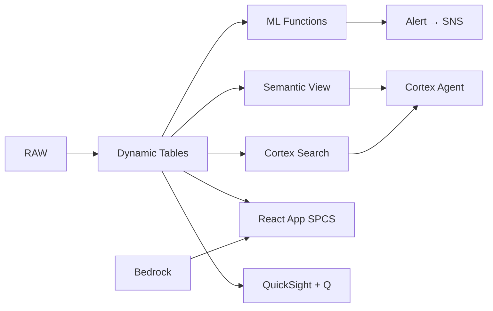

# International Patient Journey Analytics

Patient journey intelligence for Thailand's ฿140B medical tourism industry — Personalize drives package recommendations via Cortex Complete, SES delivers personalized communications through Notification Integration, and ML forecasts patient demand by source country.

## Architecture

Thailand welcomes 3.5 million medical tourists annually generating ฿140B — but fragmented patient data across 15 hospitals means personalization opportunities are missed and conversion rates are declining. AI-powered package recommendations, demand forecasting, and automated outreach capture ฿480M in additional revenue potential.



## Snowflake Capabilities

| Capability | Implementation |
|-----------|---------------|
| Dynamic Tables | PATIENT_LIFETIME_VALUE / CONVERSION_FUNNEL / PACKAGE_PERFORMANCE / SOURCE_MARKET_TRENDS |
| ML Functions | ML.FORECAST + ML.ANOMALY_DETECTION |
| Cortex AI | COMPLETE, AI_SENTIMENT, AI_CLASSIFY |
| Cortex Search | 200 documents indexed |
| Cortex Agent | PATIENT_JOURNEY_AGENT |
| Semantic View | MEDTOUR_ANALYTICS |
| React App (SPCS) | 5 tabs + DemoGuide |


## AWS Services

| Service | Role in Demo |
|---------|-------------|
| Amazon Personalize | Generate treatment package recommendations for international patients |
| Amazon SES | Send personalized patient communications in multiple languages |
| Amazon Bedrock (Claude) | Generate personalized outreach and treatment plan summaries |
| Amazon Comprehend | Sentiment analysis on patient reviews |
| Amazon SNS | Alert patient coordinators on high-value inquiries |
| Amazon QuickSight + Q | Medical tourism performance dashboard with NL queries |


## Personas

| Persona | Role | Key Questions |
|---------|------|---------------|
| **Dr. Sirichai Kanjanawasee** | Chief Medical Tourism Officer | "What's our revenue per patient by source country?" "Which treatment packages have the highest conversion rate?" |
| **Ornuma Setthabutr** | Patient Experience Director | "What package should we recommend for this Myanmar cardiac patient?" "Show me the conversion funnel for Middle Eastern aesthetic patients." |


## Data

| Table | Rows | Description |
|-------|------|-------------|
| HOSPITALS | 15 | Partner hospitals in Bangkok, Phuket, and Chiang Mai |
| PATIENTS | 45,000 | International patient records with demographics and source country |
| TREATMENT_PACKAGES | 200 | Medical tourism packages (cardiac, ortho, aesthetic, wellness, dental) |
| INQUIRIES | 120,000 | Patient inquiries via web, email, agents, and referrals |
| JOURNEYS | 85,000 | Patient journey touchpoints from inquiry to post-treatment |
| PATIENT_REVIEWS | 35,000 | Patient satisfaction reviews and NPS scores |
| REFERRAL_AGENTS | 350 | Medical tourism agents and facilitators by country |
| THAI_MEDTOUR_MARKET | 12 | Thailand medical tourism industry statistics |


## Build Instructions

### Prerequisites
- Snowflake account with ACCOUNTADMIN access
- Cortex AI enabled (ML Functions, Search, Agent)
- Warehouse: MEDTOUR_WH (Medium)
- AWS CLI with access (us-west-2)

### Deployment

```bash
snowsql -f snowflake/00_setup.sql
snowsql -f snowflake/01_marketplace_install.sql
snowsql -f snowflake/02_raw_tables.sql
snowsql -f snowflake/03_staging.sql
snowsql -f snowflake/04_dynamic_tables.sql
snowsql -f snowflake/05_search.sql
snowsql -f snowflake/06_ml_models.sql
snowsql -f snowflake/07_semantic_view.sql
snowsql -f snowflake/08_agent.sql
```

### React App (SPCS)
```bash
cd app && npm ci && npm run build
docker build -t aws-thailand-healthcare-patient-journey-app .
docker push bdiqc8sm-default.registry.snowflakecomputing.com/patient_journey/app/aws_thailand_healthcare_patient_journey/app:latest
```

### Demo Mode
Open the app URL with `?demo=true` for presenter view.

## Build Modes

### Snowflake Only
Run scripts 00-08 (skip AWS-specific integration). Uses:
- **Cortex Complete (personalization)** instead of Amazon Personalize
- **Notification Integration (email)** instead of Amazon SES
- **Cortex Complete** instead of Amazon Bedrock (Claude)
- **AI_SENTIMENT (native)** instead of Amazon Comprehend
- **Alerts + Notification Integration** instead of Amazon SNS
- **Snowflake Intelligence (Cortex Analyst)** instead of Amazon QuickSight + Q

### Full AWS + Snowflake
Run all scripts including AWS integration. Deploy QuickSight dashboard from `quicksight/`.

## Business Impact

Industry research and Snowflake customer outcomes:
- **Thailand's medical tourism generated ฿140B (US$4B) from 3.5M international patients in 2023** — [Department of Health Service Support Thailand](https://moph.go.th/en/)
- **AI-powered patient recommendations increase treatment package conversion by 25-40%** — [McKinsey Healthcare](https://www.mckinsey.com/industries/healthcare/our-insights)
- **Bumrungrad International Hospital treated 1.1M international patients from 190 countries in 2023** — [Bumrungrad](https://www.bumrungrad.com/)
- **Personalized healthcare communications improve patient engagement by 3-5x over generic messaging** — [Deloitte Health](https://www2.deloitte.com/us/en/pages/life-sciences-and-health-care.html)
- **Sanofi** (Snowflake customer): 50% performance improvement, processing 100M patient records in 4 minutes on Snowflake -- [snowflake.com/customers/sanofi](https://www.snowflake.com/en/customers/all-customers/case-study/sanofi/)

## Key Demo Numbers

- **฿4.2B** medical tourism revenue this year across 15 hospitals
- **฿320K** average revenue per patient (RPP)
- **18% conversion** aesthetic segment (down from 28% — competitor pressure)
- **45,000 patients** international patients in database
- **120K inquiries** processed with AI-classified intent
- **90-day forecast** patient demand by source country (ML.FORECAST)


## License

Apache 2.0 — See [LICENSE](LICENSE) for details.

This is a personal demo project and is not an official Snowflake offering. It comes with no support or warranty.